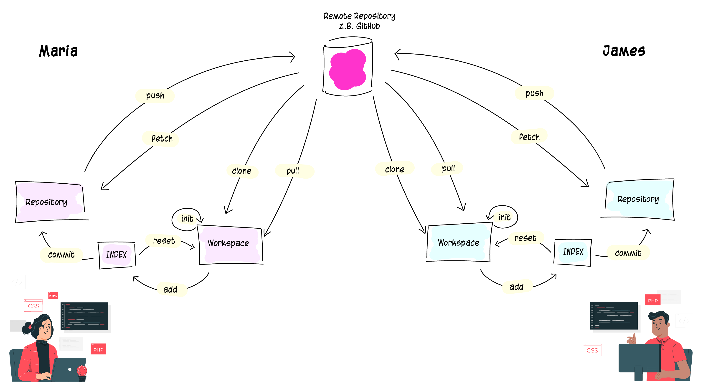
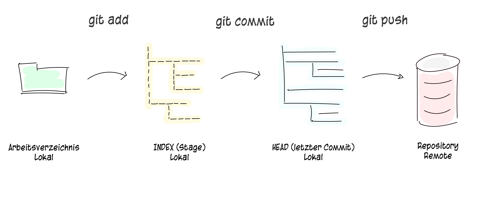
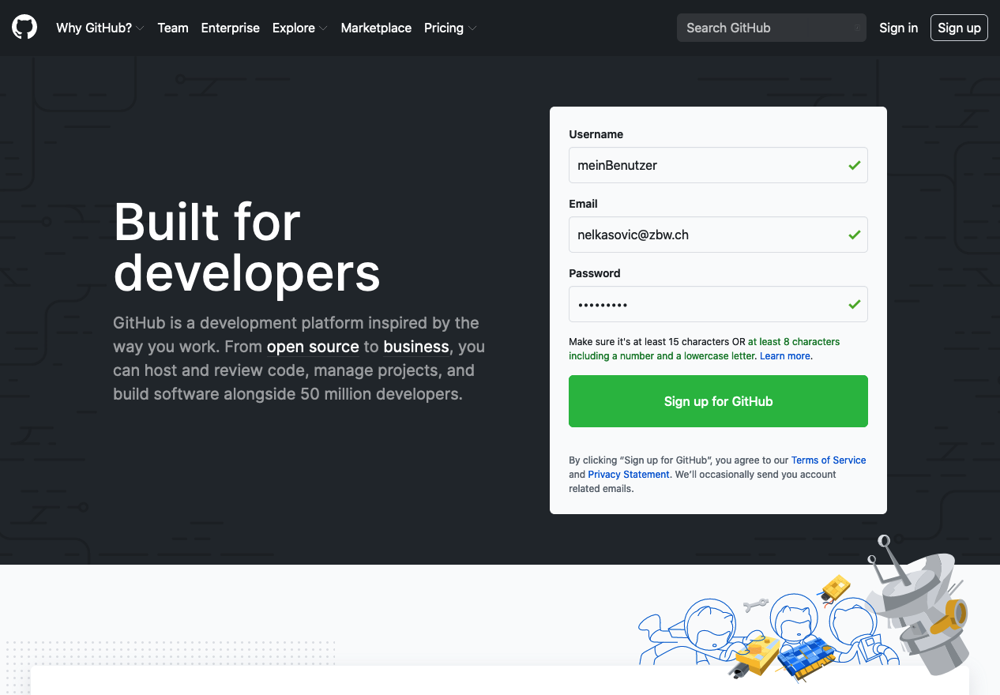

# Git

## Was ist git?
Git ist **verteiltes Versionskontrollsystemaktiv (DVCS)**. Ein Open-Source-Projekt, das 2005 ursprünglich von Linus Torvalds, dem berühmten Entwickler des Linux Betriebssystem-Kernel, entwickelt wurde.

Mit seiner verteilten Architektur ist Git ein Beispiel für ein **DVCS (Distributed Version Control System – verteiltes Versionskontrollsystem)**. Anstatt dass der volle Versionsverlauf der Software sich nur an einem einzigen Ort befindet, wie es in früher beliebten Versionskontrollsystemen wie CVS oder Subversion (auch als SVN bekannt) üblich war, ist in Git jede **Arbeitskopie der Entwickler gleichzeitig ein Repository**, das den vollständigen Verlauf aller Änderungen enthält.

Git ist jedoch nicht nur verteilt, sondern auch auf Performance, Sicherheit und Flexibilität ausgerichtet. Viele Softwaretools von Drittanbietern bieten umfangreiche Git Integration an, unter anderem Sourcetree, Jira, und auch der Code-Hostingservice Bitbucket.




#### Verteilte Versionskontrolle (Distributed Version Control System)
Git bietet einfache Verwaltung verschiedener Versionen unserer Dateien. Versionen beschreiben den Inhalt einer Datei zu einem bestimmten Zeitpunkt. Bei jeder Änderung erstellt Git eine neue Version der Datei. Jede Datei besitzt mindestens eine Version. 

Der Einsatz von Git ermöglicht uns digitale Zeitreisen durch alle Versionen unserer Dateien. Wir können zu einem beliebeigen Zeitpunkt zurück, um eine Datei zu lesen. 

#### Integrität
Von allen zu speichernden Daten berechnet Git Prüfsummen (engl. checksum) und speichert diese als Referenz zusammen mit den Daten ab. Das macht es unmöglich, dass sich Inhalte von Dateien oder Verzeichnissen ändern, ohne dass Git das mitbekommt. Git basiert auf dieser Funktionalität und sie ist ein integraler Teil der Git-Philosophie. Man kann Informationen deshalb z.B. nicht während der Übermittlung verlieren oder unwissentlich beschädigte Dateien verwenden, ohne dass Git in der Lage wäre, dies festzustellen.

Der Mechanismus, den Git verwendet, um diese Prüfsummen zu erstellen, heißt SHA-1-Hash. Eine solche Prüfsumme ist eine 40-Zeichen lange Zeichenkette, die aus hexadezimalen Zeichen (0-9 und a-f) besteht und wird von Git aus den Inhalten einer Datei oder Verzeichnisstruktur berechnet. Ein SHA-1-Hash sieht wie folgt aus:
```
24b9da6552252987aa493b52f8696cd6d3b00373
```
Diese Hashes begegnen einem überall bei der Arbeit, weil sie so ausgiebig von Git genutzt werden. Tatsächlich speichert Git alles in seiner Datenbank nicht nach Dateinamen, sondern nach dem Hash-Wert seines Inhalts.

---

## Funktionsweise von Git
Dein lokales Repository besteht aus drei &laquo;**Instanzen**&raquo;, die von git verwaltet werden. Die erste ist deine **Arbeitskopie**, welche die echten Dateien enthält. Die zweite ist der **Index**, welcher als Zwischenstufe agiert und zu guter Letzt noch der **HEAD**, der auf deinen letzten Commit zeigt.



---

## Account erstellen
Um mit Git arbeiten zu können wird ein GitHub Konto benötigt. Das Konto kann auf https://github.com eröffnet werden. Für die Registrierung wird eine gültige E-Mail Adresse benötigt auf welche du in diesem Moment zugreifen kannst. 



---

## Installation
Um Git nutzen zu können, muss der Befehl git lokal verfügbar sein. Dieser steht nach der Installation des entsprechenden Clients zur Verfügung. Vor der Installation sollten alle cmd-Fenster respektive das Terminal geschlossen werden.

- Git für OS X herunterladen: http://git-scm.com/download/mac
- Git für Windows herunterladen: http://msysgit.github.io/
- Git für Linux herunterladen: http://book.git-scm.com/2_installing_git.html

**Nach der Installation sollte der Befehl git in einem cmd/Terminal Fenster funktionieren.**

---
## Erste Schritte
Mit Git kannst du entweder:

- ein **neues Repository** initialisieren
- ein **bestehendes Repository** verwenden, dabei kannst du wählen zwischen:
  - *klonen*: in ein Repository einsteigen und mitwirken
  - *forken*: ein Repository kopieren und selbst daran weiterarbeiten

Unabhängig davon welchen Weg du einschlägst, es stehen dir die gleichen Befehle zur Verfügung.

### Neues Repository erstellen
Um in einem lokalen **Arbeitsverzeichnis** auf deinem Computer ein **Git-Repository** zu initialisieren, kannst du im Terminal diesen Befehl eingeben:
```
git init
```
Alle Änderungen innerhalb dieser Verzeichnisstruktur werden nun verfolgt. Alle Dateien werden versioniert abgespeichert. Wenn du nun das Repository mit anderen teilen möchtest und es zentral "in der Cloud" haben möchtest, kannst du bei z.B. GitHub ein Repository erstellen und das lokale Repository mit dem bei GitHub verknüpfen. 

- Bei github.com anmelden (früher eröffnetes Konto vorausgesetzt)
- Zu https://github.com/new wechseln
- Felder «Name» (keine Leerzeichen, Striche verwenden) und «Description» ausfüllen
- Bei «Private» oder «Public» wählen (Privat heisst, nur für dich sichtbar)
- Mit «Create Repository» bestätigen

Danach kann das lokale Repository mit dem GitHub Repository wie folgt verknüpft werden:
```
git remote add origin git@github.com:nelkasovic/gitintro.git
```
Bitte beachte, dass bei git remote add origin der Name des eigenen Repository stehen muss.

### README erstellen
Jedes Repository hat im Normalfall eine README-Datei. Das ist meistens die erste Datei die erstellt wird. Diese Datei umfasst die wichtigsten Infos zum Projekt oder Repository. Dort ist oft die Anleitung verfasst, wie man mit dem Repository arbeiten kann. Diese Datei erstellst du jetzt in deinem Repository.

Wechsle dazu ins Repository-Verzeichnis (dort wo du den init Befehl ausgeführt hast. und gebe folgende Befehle ein. Du musst jeden Befehl einzeln mit Enter bestätigen und Meldung lesen, ob erfolgreich.
```
echo "# Mein GitHub Repository" >> README.md 
```
Alternativ kannst du diese Datei auch in einem Editor erstellen.

### Bestehendes Repository verwenden
Erstelle eine Arbeitskopie von einem bestehenden entfernten Repository, indem du folgenden Befehl ausführst:
```
git clone git@github.com:nelkasovic/gitintro.git
```
Allgemeine Syntax:
```
git clone /pfad/zum/repository
git clone benutzername@host:/pfad/zum/repository
```

### Änderungen hinzufügen

Sobald das Repository initialisiert und verknüpft ist, kannst du deine Änderungen vorschlagen (zum Index hinzufügen).

Einzelne Änderungen/Dateien mit:
```
git add README.md
```
Alle Änderungen/Dateien mit:
```
git add *
```
Der nächste Schritt im git workflow ist die Änderungen zu bestätigen mit:
```
git commit -m "README Datei hinzugefügt"
```
Danach befindet sich die Änderung im HEAD, aber noch nicht im entfernten Repository.

###Änderungen hochladen
Die Änderungen sind jetzt im HEAD deines lokalen Repositories. Um die Änderungen an dein entferntes Repository zu senden, führe aus:
```
git push -u origin master
```
Du kannst master auch mit einem beliebigen anderen Branch ersetzen, mehr über Branches erfährst du später. Danach kannst du den Parameter -u weglassen. Verwende zukünftig nur noch:
```
git push origin master
```

#### Sonderfall
Wenn du dein lokales Repository nicht von einem entfernten geklont hast und du diese aber mit einem anderen Repository verbinden möchtest, musst du dieses mit hinzufügen:
```
git remote add origin <server>
```
Danach bist du bereit, deine Änderungen hochzuladen.

### Updates holen
Um dein lokales Repository mit den neuesten Änderungen zu aktualisieren, verwende in deiner Arbeitskopie den folgenden Befehl:
```
git pull
```
Änderungen zuerst herunterladen kannst du mit:
```
git fetch
```

### Merge
Wenn du einen anderen Branch mit deinem aktuellen (z.B. master) zusammenführen willst, benutze:
```
git merge 
```
In beiden Fällen versucht git die Änderungen automatisch zusammenzuführen. Unglücklicherweise ist dies nicht immer möglich und endet in Konflikten. Du bist verantwortlich, diese Konflikte durch manuelles Editieren der betroffenen Dateien zu lösen. Bist du damit fertig, musst du das git mit folgendem Befehl mitteilen:
```
git add 
```
Bevor du Änderungen zusammenführst, kannst du dir die Differenzen auch anschauen:
```
git diff 
```

## Änderungen rückgängig machen
Falls du mal etwas falsch machst, kannst du die lokalen Änderungen auf den letzten Stand im HEAD zurücksetzen mit:
```
git checkout -- <filename>
```
Änderungen, die du bereits zum Index hinzugefügt hast, bleiben bestehen. 

Wenn du aber deine lokalen Änderungen komplett entfernen möchtest, holst du dir den letzten Stand vom entfernten Repository mit folgenden Befehlen:
```
git fetch origin
git reset --hard origin/master
```

## Branches
Branches werden benutzt, um verschiedene Funktionen isoliert voneinander zu entwickeln. Der master-Branch ist der "Standard"-Branch, wenn du ein neues Repository erstellst. Du solltest aber für die Entwicklung andere Branches verwenden und diese dann in den Master-Branch zusammenführen (mergen). Auch das lernst du später.


Erstelle einen neuen Branch mit dem Namen "feature_x" und wechsle zu diesem:
```
git checkout -b feature_x
```
Um zum Master zurück zu wechseln:
```
git checkout master
```
Und um den eben erstellten Branch wieder zu löschen:
```
git branch -d feature_x
```
Ein Branch ist nicht für andere verfügbar, bis du diesen in dein entferntes Repository hochlädst:
```
git push origin <branch>
```

## Tagging

Es wird empfohlen, für Software Releasestags zu verwenden. Dies ist ein bekanntes Konzept, das es schon mit SVN gab. Du kannst einen neuen Tag namens 1.0.0 mit folgendem Befehl erstellen:
```
git tag 1.0.0 1b2e1d63ff
```
1b2e1d63ff steht für die ersten 10 Zeichen der Commit-Id, die du mit deinem Tag referenzieren möchtest. Du erhältst die Liste der Commit-IDs mit: 
```
git log
```
Du kannst auch weniger Zeichen verwenden, es muss einfach eindeutig sein.


## Kollaboratoren einladen
Um gemeinsam mit anderne Entwicklern an einem Projekt zu arbeiten, können für jedes Repository weitere GitHub Nutzer als sogenannte Collaborators eingeladen werden. Der Nutzer, den Sie einladen, erhält eine E-Mail, in dieser zum Repository eingeladen wird. Sobald die Einladung angenommen wird, hat der Nutzer Zugriff auf Ihr Repository.


## Markdown erforschen

Markdown ist eine Auszeichnungssprache, genau wie HTML nur einfacher. Ein simples **fett** wird auf Markdown-fähigen Seiten genauso dargestellt wie die HTML-Variante. Genauer gesagt: Sie wird in die HTML-Variante übersetzt. Die Markdown-Auszeichnungen sind deutlich einfacher zu merken und vor allem zu tippen.

- [Markdown Cheatsheet](https://guides.github.com/pdfs/markdown-cheatsheet-online.pdf)
- [Mastering Markdown (online Version)](https://guides.github.com/features/mastering-markdown/)

## Tipps & Tricks
Git User-Konfiguration:
```
git config user.name "Nermin Elkasovic"
```
Git User-Konfiguration:
```
git config user.email "email@address.com"
```
Git User-Konfiguration auflisten:
```
git config --list
```
Eingebaute git-GUI:
```
gitk
```
Farbige Konsolenausgabe:
```
git config color.ui true
```
Eine Zeile pro Commit in der Logausgabe:
```
git config format.pretty oneline
```
Interaktives Hinzufügen von Änderungen:
```
git add -i
```
Letzten Commit herunterladen, ändern und überschreiben:
```
git reset --soft HEAD~1
git add .
git commit -m "Nachricht"
git push -f
```