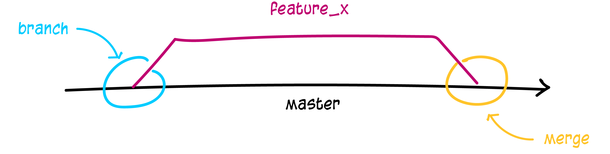

# Branches

Branches werden benutzt, um verschiedene Funktionen isoliert voneinander zu entwickeln. Der master-Branch ist der "Standard"-Branch, wenn du ein neues Repository erstellst. Du solltest aber für die Entwicklung andere Branches verwenden und diese dann in den Master-Branch zusammenführen (mergen). Auch das lernst du später.



Erstelle einen neuen Branch mit dem Namen "feature_x" und wechsle zu diesem:

```
git checkout -b feature_x
```

Um zum Master zurück zu wechseln:

```
git checkout master
```

Und um den eben erstellten Branch wieder zu löschen:

```
git branch -d feature_x
```

Ein Branch ist nicht für andere verfügbar, bis du diesen in dein entferntes Repository hochlädst:

```
git push origin <branch>
```
### [__Weiter](Tagging.md)