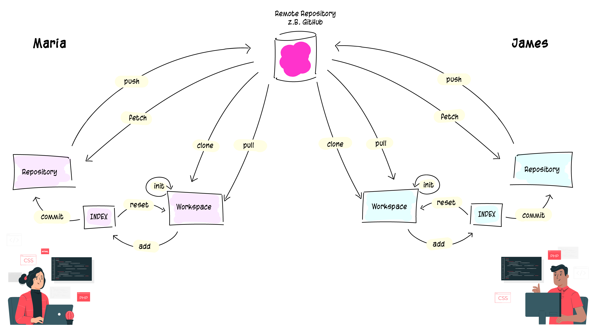

# Was ist git?

Git ist **verteiltes Versionskontrollsystemaktiv (DVCS)**. Ein Open-Source-Projekt, das 2005 ursprünglich von Linus Torvalds, dem berühmten Entwickler des Linux Betriebssystem-Kernel, entwickelt wurde. 

Durch Git wird ein **Arbeitsverzeichnis zu einem Repository**, welches den vollständigen Verlauf aller Änderungen enthält. Das ermöglicht uns digitale **Zeitreisen** durch die bisherigen Änderungen. Zu einem beliebeigen Zeitpunkt zurückspringen und den **Stand von damals wiederherstellen** ist ein Kinderspiel.

Abgesehen davon können **beliebig viele Entwickler an einem Repository** gemeinsam arbeiten und Ihre Änderungen verfolgen, vorschlagen, zusammenführen oder rückgängig machen.

### [__Weiter](DVCS.md)
