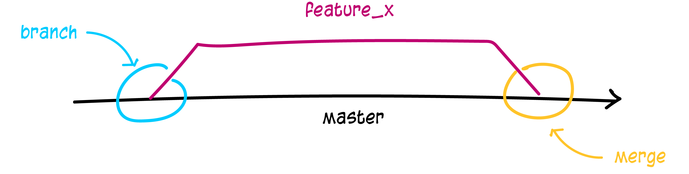

# Branches

Branches werden benutzt, um verschiedene Funktionen **isoliert voneinander** zu entwickeln. Der master-Branch ist der der **vorgeschlagene Standard-Branch**, wenn du ein neues Repository erstellst. Das kannst du auch ändern. Für die Entwicklung solltest du Branches verwenden und diese dann in den Master-Branch zusammenführen (mergen).



Neuen Branch mit dem Namen "feature_x" **erstellen** und auschecken kannst du mit:

```
git checkout -b feature_x
```

Zum master-Branch zurück **wechseln** kannst du mit:

```
git checkout master
```

Den eben erstellten Branch wieder **löschen** kannst du mit:

```
git branch -d feature_x
```

Den neuen Branch ins entfernte Repository hochladen kannst du mit:

```
git push origin <branch>
```

Ein neuer Branch ist für andere erst dann verfügbar, wenn du diesen hochgeladen hast.

### [Startseite](index.md) // [Zurück](revert.md) // [Weiter](tagging.md)
