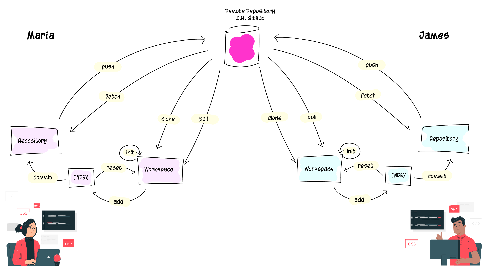

# Distributed Version Control System

Eine der Hauptaufgaben von Git ist es, **bei jeder Änderung eine neue Version** der geänderten Datei zu erstellen. Damit besitzt jede Datei mindestens eine Version. **Versionen** beschreiben den Inhalt einer Datei zu einem bestimmten Zeitpunkt. Beim Hochladen ins **entfernte Repository** (auf z.B. GitHub), unterstützt Git uns dies verlustfrei durchzuführen und versucht alle Konflikte automatisch aufzulösen. 

---


[](./assets/images/git_workflow_repos.png)

---

## Integrität

Von allen zu speichernden Daten berechnet Git **Prüfsummen** und speichert diese als Referenz zusammen mit den Daten ab. Das macht es unmöglich, dass sich Inhalte von Dateien oder Verzeichnissen ändern, ohne dass Git das mitbekommt.

Der Mechanismus, den Git verwendet, um diese Prüfsummen zu erstellen, heisst SHA-1-Hash. Eine solche Prüfsumme ist eine **40-Zeichen** lange Zeichenkette, die aus hexadezimalen Zeichen (0-9 und a-f) besteht und wird von Git aus den Inhalten einer Datei oder Verzeichnisstruktur berechnet. Ein SHA-1-Hash sieht wie folgt aus:

```
24b9da6552252987aa493b52f8696cd6d3b00373
```

Diese Hashes begegnen einem überall bei der Arbeit, weil sie so ausgiebig von Git genutzt werden. Tatsächlich speichert Git alles in seiner Datenbank nicht nach Dateinamen, sondern nach dem Hash-Wert seines Inhalts.

### [Startseite](index.md) // [Zurück](index.md) // [Weiter](repository.md)
