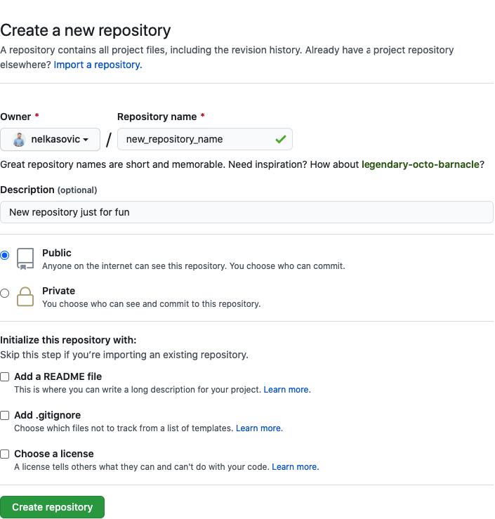

# Entferntes Repository

Um dein Repository mit anderen zu teilen, kannst du bei z.B. [GitHub](https://github.com) ein Repository erstellen und das lokale Repository mit dem bei GitHub verknüpfen. Eröffne dort **kostenlos** ein Konto mit einer gültigen E-Mail Adresse. Bis auf wenige Einschränkungen, die für uns nicht relevant sind, kann GitHub frei genutzt werden. 

## Erstellen 
-   Bei [GitHub](https://github.com) registrieren & anmelden 
-   Neues [Repository](https://github.com/new) erstellen
-   Felder «Name» (keine Leerzeichen, Striche verwenden) und «Description» ausfüllen
-   Bei «Private» oder «Public» wählen (Privat heisst, nur für dich sichtbar)
-   Mit «Create Repository» bestätigen 

---



---


## Verknüpfen

Danach kann das lokale Repository mit dem GitHub Repository verknüpft werden mit:

```
git remote add origin git@github.com:nelkasovic/gitintro.git
```

Nach `git remote add origin` muss der Name des eigenen Repository stehen.


## Zu erledigen
- [ ] GitHub Account eröffnen
- [ ] Remote Repository erstellen
- [ ] Lokales Repository mit Remote verknüpfen


### [Startseite](index.md) // [Zurück](init.md) // [Weiter](echo.md)
