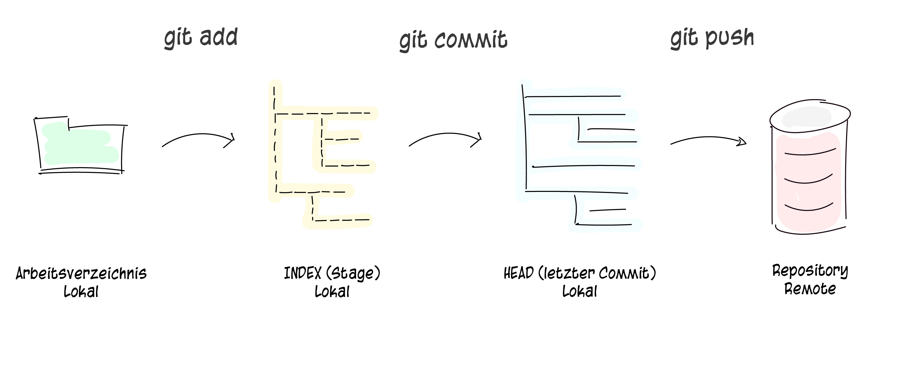

# Repository

Ein lokales Repository besteht aus drei &laquo;**Instanzen**&raquo;, die von git verwaltet werden. Die erste ist deine **Arbeitskopie**, welche die echten Dateien enthält. Die zweite ist der **Index**, welcher als Zwischenstufe agiert und zu guter Letzt noch der **HEAD**, der auf deinen letzten Commit zeigt.

## Entferntes Repository

Um dein Repository mit anderen zu teilen, kannst du [GitHub](https://github.com) verwenden. Eröffne dort **kostenlos** ein Konto mit einer gültigen E-Mail Adresse. Bis auf wenige Einschränkungen, die für uns nicht relevant sind, kann GitHub frei genutzt werden.

### [Startseite](start.md) // [Weiter](installation.md)
