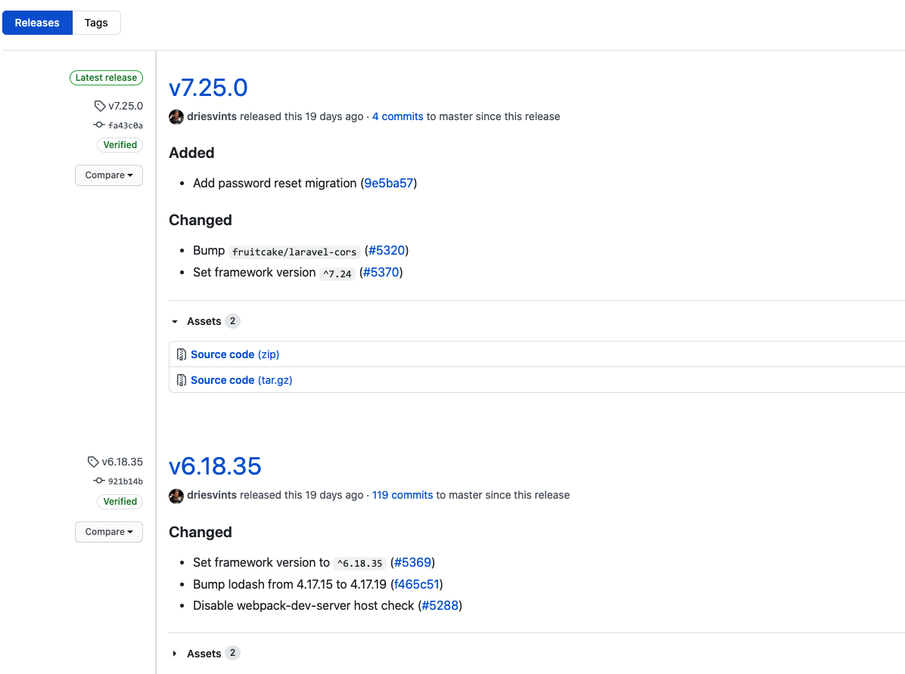

# Tagging

Für Software werden **Releasestags** empfohlen. Einen neuen Tag namens `1.0.0` mit erstellst du mit:

```
git tag 1.0.0 1b2e1d63ff
```

Eine Liste der Commit-IDs erhältst du mit:

```
git log
```

Hier steht **1b2e1d63ff** für die ersten 10 Zeichen der Commit-Id, die du mit deinem Tag referenzieren möchtest. Du kannst auch weniger Zeichen verwenden, es muss einfach eindeutig sein.



### [Startseite](start.md) // [Weiter](collaborators.md)
